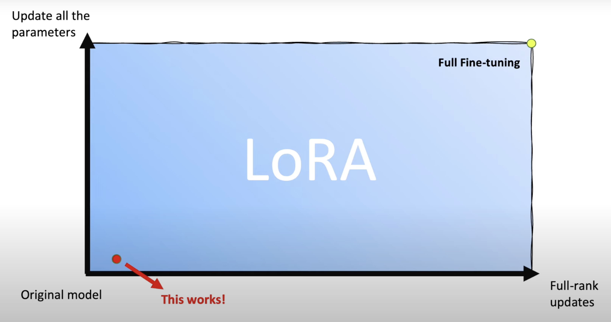
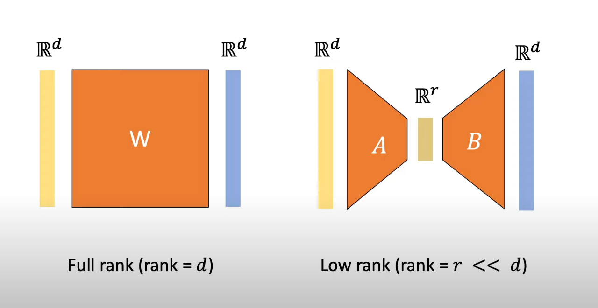

# LoRA: Low-Rank Adaptation of Large Language Models

---

## Introduction
**LoRA (Low-Rank Adaptation)** is an efficient fine-tuning method for large language models, such as GPT-3. By updating only a subset of parameters, LoRA enables model adaptation to specific tasks with minimal resource use, advancing parameter-efficient fine-tuning.

---

## Overview
In 2021, large models like GPT-3 showed strong performance in language generation but faced challenges in specialized tasks like natural language-to-code translation. Traditional fine-tuning—updating all model parameters—was impractical due to the high storage and computational demands for each task.

**LoRA** solves these issues by applying low-rank matrix decomposition to specific layers. This significantly reduces resource usage while maintaining model performance, enabling adaptable fine-tuning without the burden of updating the entire model.

---

## LoRA’s Approach
LoRA’s method can be broken down into three key techniques:

1. **Matrix Decomposition**: Decomposes large weight matrices into smaller, low-rank matrices.
2. **Selective Updates**: Only updates specific attention layers, minimizing resource usage.
3. **Merging for Inference**: Merges low-rank updates back into the model, ensuring latency-free inference.

---

## Problem Addressed
LoRA uses low-rank updates in critical model layers, such as attention layers, to store task-specific information with minimal parameter adjustments, making it feasible to adapt large models without high computational and memory costs.



*Figure 1: Addressing the Problem (Image source: [What is Low-Rank Adaptation (LoRA) | explained by the inventor](https://www.youtube.com/watch?v=DhRoTONcyZE))*

---

## Architecture Overview
LoRA’s architecture leverages matrix decomposition for efficient updates:

- **Initialization**: Start with a frozen pre-trained model.
- **Matrix Decomposition**: Decompose weight matrices in attention layers into two low-rank matrices.
- **Parameter Updates**: Update only the low-rank matrices.
- **Merging**: Merge updates for latency-free inference.



*Figure 2: Architecture Overview (Image source: [LoRA Paper](https://arxiv.org/pdf/2106.09685))*

In the figure above, the left side shows a traditional full-rank weight matrix \( W \) with rank \( d \). LoRA replaces this with two smaller matrices, \( A \) and \( B \), shown on the right, with a low-rank \( r \) (where \( r \ll d \)). By passing the input through these low-rank matrices, LoRA captures the essential information needed for task-specific adaptation while significantly reducing storage and computational requirements.

---

## Pseudocode Walkthrough

```python
# LoRA Pseudocode

# Initialize LoRA-specific parameters
d = model_dimension               # Dimension of the original model weight matrix W (e.g., d x d for square matrices)
r = low_rank_dimension             # Desired rank for the low-rank approximation (r << d)
num_layers = model_num_layers      # Number of layers in the model
learning_rate = predefined_lr      # Learning rate for fine-tuning

# Step 1: Define Low-Rank Decomposition of Weight Matrix
def decompose_weight_matrix(W, r):
    A = initialize_matrix(d, r)    # Initialize A with random values or from a Gaussian distribution
    B = initialize_matrix(r, d)    # Initialize B with zeroes
    return A, B

# Step 2: Initialize Model Parameters with LoRA
for layer in range(num_layers):
    W = model[layer].weight_matrix   # Retrieve the original weight matrix for the layer
    A, B = decompose_weight_matrix(W, r)  # Perform low-rank decomposition
    model[layer].A = A               # Assign A and B as part of the model's parameters for this layer
    model[layer].B = B

# Step 3: Forward Pass with Low-Rank Adaptation
def forward_pass(input_data, model):
    for layer in range(num_layers):
        W = model[layer].weight_matrix
        A = model[layer].A
        B = model[layer].B
        W_lora = W + A @ B   # Compute the effective weight by adding low-rank updates
        input_data = layer_forward(input_data, W_lora)
    return input_data

# Step 4: Backward Pass and Update A and B
def backward_pass_and_update(model, gradients, learning_rate):
    for layer in range(num_layers):
        grad_W = gradients[layer]    # Get gradient with respect to W
        model[layer].A -= learning_rate * grad_W @ model[layer].B.T
        model[layer].B -= learning_rate * model[layer].A.T @ grad_W

# Step 5: Training Loop
for epoch in range(num_epochs):
    output = forward_pass(input_data, model)
    loss = compute_loss(output, target_data)
    gradients = compute_gradients(loss, model)
    backward_pass_and_update(model, gradients, learning_rate)
    print(f"Epoch {epoch}: Loss = {loss}")
```


## Code Demonstration
The full code for LoRA’s implementation is available in the [Jupyter notebook](https://colab.research.google.com/drive/1S91tGPShEW4-fYSFW9JO94EgQ0roPnGh) within this repository.

## Comparison with Existing Methods
- **Traditional Fine-Tuning**: Involves updating all model parameters, leading to high resource demands.
- **Prefix Tuning & Adapters**: Adds parameters but lacks LoRA’s adaptability.
- **BitFit**: Updates only bias terms, which is less expressive than LoRA for complex tasks.

## Why LoRA’s Approach is Unique

LoRA introduces a highly efficient way to adapt large models by focusing on the **low intrinsic rank** of weight matrices in pre-trained models. Key unique aspects of LoRA’s approach include:

- **Low-Rank Adaptation**: LoRA assumes that the weight matrices in large models have a low intrinsic rank, which allows it to represent necessary information through smaller, low-rank matrices. This minimizes storage and update requirements compared to traditional fine-tuning.
- **Minimal Storage and Update Requirements**: By using low-rank matrix decomposition, LoRA achieves results comparable to full fine-tuning while updating only a small fraction of parameters. This reduces memory and computational demands significantly.
- **Zero-Latency Task Switching**: LoRA’s ability to merge low-rank updates back into the original model enables rapid task switching with no additional inference latency. This advantage is especially useful in dynamic applications requiring frequent adaptation to new tasks.
- **Flexibility Across Domains**: While originally developed for language models, LoRA’s principles are adaptable to other domains, making it versatile for applications like computer vision and beyond. This adaptability provides flexibility not offered by traditional fine-tuning or other efficient tuning methods.

## Critical Analysis

While LoRA offers a groundbreaking approach to fine-tuning, several limitations and considerations are important:

- **Dependence on Low-Rank Assumption**: LoRA’s efficiency hinges on the low-rank assumption, which may not be suitable for all tasks. For instance, tasks requiring substantial parameter changes (e.g., cross-lingual transfers) may not perform as effectively under this assumption.
- **Parameter Tuning Complexity**: Choosing the appropriate rank for different tasks requires fine-tuning, which can be a non-trivial process and adds complexity to LoRA’s implementation.
- **Transformer Architecture Dependence**: LoRA is particularly suited to transformer models, raising questions about its applicability to other architectures, such as convolutional networks. Extending LoRA’s effectiveness to non-transformer models would require further exploration.
- **Community Reception and Future Validation**: LoRA has been widely appreciated for its balance of efficiency and performance. However, further studies across diverse models and tasks are needed to validate and potentially expand its use cases beyond current applications.

## Impact on AI

LoRA has transformative implications for the future of scalable and adaptable AI:

- **Enabling Scalable, Cost-Effective Fine-Tuning**: LoRA drastically reduces resource requirements, making it feasible to fine-tune large models for specific applications in both research and industry. This meets the growing demand for affordable and scalable solutions in AI.
- **Broadening Application to Other Domains**: LoRA’s low-rank adaptation principles have extended beyond language models, showing promise in fields like computer vision, diffusion models for image generation, and scientific models requiring efficient fine-tuning.
- **Synergy with Model Efficiency Techniques**: LoRA complements other efficiency strategies such as quantization, pruning, and model compression. Its low-rank adaptation could be combined with these methods to create even more resource-efficient AI systems.
- **Foundation for Future AI**: By providing a flexible, resource-efficient solution, LoRA has established itself as a foundational technique for the next generation of AI systems. Its ability to allow rapid task adaptation with minimal latency positions it as a key enabler for adaptable, cost-effective AI applications across a variety of emerging fields.


## Discussion Questions

### 1. Why is few-shot prompting insufficient for certain tasks?

Few-shot prompting, though powerful for general-purpose language generation, is limited when it comes to tasks that demand high levels of specialization or nuanced understanding. While few-shot methods allow models to leverage general pre-trained knowledge, they fall short in more complex domains, such as translating technical language to code or summarizing scientific literature. These tasks require task-specific knowledge that general language models often lack. Additionally, few-shot prompting lacks the fine-grained control needed to produce structured or rule-based outputs, leading to inconsistency in results, especially when working with tasks like SQL generation or programming language tasks that require strict formatting. Although few-shot prompting avoids the computational demands of full fine-tuning, complex tasks often necessitate lengthy and detailed prompts, which can introduce inefficiencies in terms of memory and processing requirements. Furthermore, few-shot prompting methods cannot adapt to tasks that evolve over time or require iterative improvements, as they lack the capability to learn from feedback and refine outputs based on specific needs. In summary, while few-shot prompting is an effective starting point, it struggles with tasks that require specialized knowledge, structured outputs, or iterative adaptation.

### 2. How might LoRA’s approach benefit applications beyond language models, such as image recognition?

LoRA’s low-rank adaptation offers several benefits for applications outside of language modeling, including fields like image recognition. Just as in language models, vision models such as convolutional neural networks or transformers for images contain large parameter spaces that don’t require exhaustive updates for task-specific adaptation. By focusing on low-rank matrix decomposition, LoRA enables efficient fine-tuning in vision tasks like image classification, object detection, and segmentation, adapting models with minimal updates to parameters and therefore reducing computational load. For resource-constrained environments, such as edge devices like mobile phones and IoT devices, LoRA's efficiency in memory and computation is particularly valuable. Vision models can be adapted to specialized tasks without overwhelming the memory and compute limits of these devices. Furthermore, LoRA allows for targeted updates that make it easier to fine-tune vision models for specific domains, such as adapting models for medical imaging versus general object recognition, without requiring a full retraining of the model. Additionally, LoRA's approach could be advantageous in multi-modal applications, such as those combining vision and language data, as it allows for selective parameter tuning in either the vision or language components. Overall, LoRA’s adaptable, resource-efficient framework extends well beyond language models, promising effective, scalable model adaptations for a range of vision and other parameter-intensive applications.


## Resource Links
1. [LoRA Paper](https://arxiv.org/abs/2106.09685)
2. [Original Video Explanation](https://www.youtube.com/watch?v=dQw4w9WgXcQ)
3. [Code Implementation](https://www.youtube.com/watch?v=iYr1xZn26R8&t=17s)
4. [Intrinsic Dimensionality Paper](https://arxiv.org/abs/2012.13255)
5. [Microsoft LoRA Repo](https://github.com/microsoft/lora)

## Repo
This repository includes:
- A README with a detailed overview.
- A Jupyter notebook with LoRA code demonstration.
- Video presentation

## Citation for Paper
Hu, E., Shen, Y., Wallis, P., Allen-Zhu, Z., Li, Y., Wang, L., & Chen, W. (2021). LoRA: Low-Rank Adaptation of Large Language Models. arXiv preprint arXiv:2106.09685.
