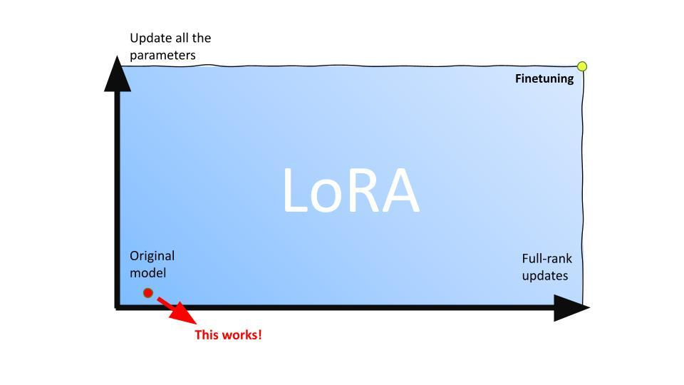
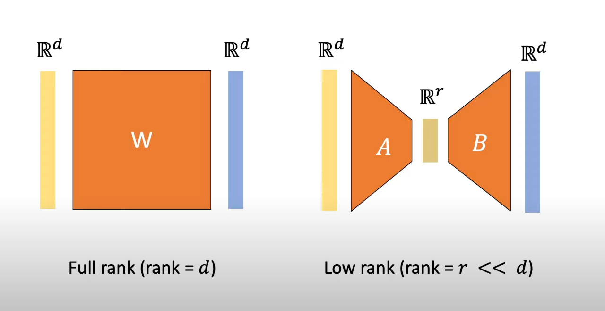

# LoRA: Low-Rank Adaptation of Large Language Models

## Introduction
**LoRA (Low-Rank Adaptation)** is an efficient fine-tuning method for large language models, such as GPT-3. By updating only a subset of parameters, LoRA enables model adaptation to specific tasks with minimal resource use, advancing parameter-efficient fine-tuning.

## Overview
When large models like GPT-3 became available in 2021, they showed promising results in language generation but struggled with specialized tasks, such as natural language-to-code translation. Traditional fine-tuning—updating all parameters—proved impractical due to the high storage and computation required for every task adaptation.

**LoRA** addresses these issues by applying low-rank matrix decomposition within specific layers. This reduces resource demands significantly while maintaining model performance, enabling adaptable fine-tuning without the burden of updating the entire model.

## LoRA’s Approach
LoRA’s key techniques include:
1. **Matrix Decomposition**: Decomposes large weight matrices into smaller, low-rank matrices.
2. **Selective Updates**: Only updates specific attention layers, minimizing resource usage.
3. **Merging for Inference**: Merges low-rank updates back into the model for latency-free inference.

## Problem Addressed
LoRA selectively applies low-rank updates to critical model layers, such as attention layers, to store task-specific information with minimal parameter adjustments. This makes it feasible to adapt large models without high computational and memory costs.



*Figure 1: Addressing the Problem (Image source: [What is Low-Rank Adaptation (LoRA) | explained by the inventor](https://www.youtube.com/watch?v=DhRoTONcyZE))*

## Architecture Overview
LoRA’s architecture leverages matrix decomposition for efficient updates:
- **Initialization**: Start with a frozen pre-trained model.
- **Matrix Decomposition**: Decompose weight matrices in attention layers into two low-rank matrices.
- **Parameter Updates**: Update only the low-rank matrices.
- **Merging**: Merge updates for latency-free inference.



*Figure 2: Architecture Overview (Image source: [LoRA Paper](https://arxiv.org/pdf/2106.09685))*

In the figure above, the left side shows a traditional full-rank weight matrix \( W \) with rank \( d \). LoRA replaces this with two smaller matrices, \( A \) and \( B \), shown on the right, with a low-rank \( r \) (where \( r \ll d \)). By passing the input through these low-rank matrices, LoRA captures the essential information needed for task-specific adaptation while significantly reducing storage and computational requirements. This decomposition allows for efficient fine-tuning without modifying the original model’s core weights.


```
# LoRA Pseudocode

# Initialize LoRA-specific parameters
d = model_dimension               # Dimension of the original model weight matrix W (e.g., d x d for square matrices)
r = low_rank_dimension             # Desired rank for the low-rank approximation (r << d)
num_layers = model_num_layers      # Number of layers in the model
learning_rate = predefined_lr      # Learning rate for fine-tuning

# Step 1: Define Low-Rank Decomposition of Weight Matrix
def decompose_weight_matrix(W, r):
    """
    Decompose the weight matrix W into two smaller matrices A and B with rank r.
    Args:
        W: Original weight matrix (size d x d)
        r: Desired rank for the decomposition
    Returns:
        A: Low-rank matrix of size (d x r)
        B: Low-rank matrix of size (r x d)
    """
    A = initialize_matrix(d, r)    # Initialize A with random values or from a Gaussian distribution
    B = initialize_matrix(r, d)    # Initialize B with zeroes
    return A, B

# Step 2: Initialize Model Parameters with LoRA
for layer in range(num_layers):
    W = model[layer].weight_matrix   # Retrieve the original weight matrix for the layer
    A, B = decompose_weight_matrix(W, r)  # Perform low-rank decomposition
    model[layer].A = A               # Assign A and B as part of the model's parameters for this layer
    model[layer].B = B

# Step 3: Forward Pass with Low-Rank Adaptation
def forward_pass(input_data, model):
    """
    Perform a forward pass using LoRA.
    Args:
        input_data: Input data for the model
        model: Model with low-rank adaptation
    Returns:
        output: Output of the model after forward pass
    """
    for layer in range(num_layers):
        W = model[layer].weight_matrix
        A = model[layer].A
        B = model[layer].B
        
        # Compute the effective weight by adding low-rank updates
        W_lora = W + A @ B   # "@" denotes matrix multiplication
        
        # Perform forward pass through the layer with W_lora as the effective weight matrix
        input_data = layer_forward(input_data, W_lora)
    
    output = input_data   # Final output after all layers
    return output

# Step 4: Backward Pass and Update A and B
def backward_pass_and_update(model, gradients, learning_rate):
    """
    Backpropagate and update only A and B matrices for LoRA layers.
    Args:
        model: Model with low-rank adaptation
        gradients: Gradients from loss computation
        learning_rate: Learning rate for updating parameters
    """
    for layer in range(num_layers):
        grad_W = gradients[layer]    # Get gradient with respect to W
        
        # Update A and B based on gradients, keeping W frozen
        model[layer].A -= learning_rate * grad_W @ model[layer].B.T
        model[layer].B -= learning_rate * model[layer].A.T @ grad_W

# Step 5: Training Loop
for epoch in range(num_epochs):
    # Forward pass
    output = forward_pass(input_data, model)
    
    # Compute loss and gradients
    loss = compute_loss(output, target_data)
    gradients = compute_gradients(loss, model)
    
    # Backward pass and update A and B
    backward_pass_and_update(model, gradients, learning_rate)
    
    # Print loss or other training information if needed
    print(f"Epoch {epoch}: Loss = {loss}")


```


## Code Demonstration
The full code for LoRA’s implementation is available in the [Jupyter notebook](https://colab.research.google.com/drive/1S91tGPShEW4-fYSFW9JO94EgQ0roPnGh) within this repository.

## Comparison with Existing Methods
- **Traditional Fine-Tuning**: Involves updating all model parameters, leading to high resource demands.
- **Prefix Tuning & Adapters**: Adds parameters but lacks LoRA’s adaptability.
- **BitFit**: Updates only bias terms, which is less expressive than LoRA for complex tasks.

## Why LoRA is Unique
LoRA leverages the **low intrinsic rank** of weight matrices in large models, allowing efficient adaptation with minimal updates. Its **zero-latency task switching** makes it suitable for dynamic applications requiring rapid adaptation.

## Critical Analysis
LoRA is effective but has limitations, such as reduced performance on tasks requiring significant parameter changes. Its dependence on transformer-based models raises questions about generalizability to other architectures.

## Impact on AI
LoRA enables scalable, cost-effective AI, extending its utility across fields like computer vision. It complements other techniques, like quantization, advancing the field toward more resource-efficient AI systems.

## Questions for Discussion
1. **Why is few-shot prompting insufficient for certain tasks?**
2. **How might LoRA’s approach benefit applications beyond language models, such as image recognition?**

## Resource Links
1. [LoRA Paper](https://arxiv.org/abs/2106.09685)
2. [Original Video Explanation](https://www.youtube.com/watch?v=dQw4w9WgXcQ)
3. [Blog Post on Efficient Tuning Methods](https://exampleblog.com/lora-efficient-tuning)
4. [Related Research Paper](https://arxiv.org/abs/2107.02137)

## Code Demonstration
A Jupyter notebook demonstrating LoRA’s implementation and usage is included in the repository.

## Repo
This repository includes:
- A README with a detailed overview.
- A Jupyter notebook with LoRA code demonstration.
- Links to video resources and additional reading.

## Citation for Paper
Hu, E., Shen, Y., Wallis, P., Allen-Zhu, Z., Li, Y., Wang, L., & Chen, W. (2021). LoRA: Low-Rank Adaptation of Large Language Models. arXiv preprint arXiv:2106.09685.
